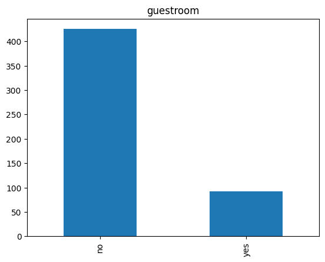
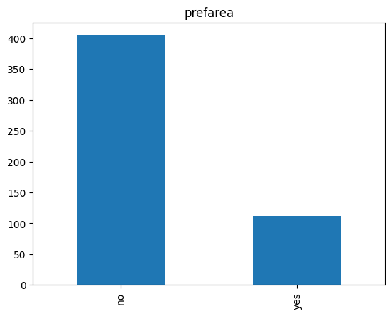

# Laporan Proyek Machine Learning - Nurul Nyi Qoniah

## Domain Proyek

Membuat model predictive analytics (housing price prediction) menggunakan dataset dari Kaggle [Housing Dataset](https://www.kaggle.com/code/abdelrahmanramadan2/housing-price-prediction-using-linear-regression) sebagai salah satu submission Dicoding. Pada proyek ini akan diprediksi harga rumah dengan menggunakan dataset yang tersedia sebelumnya.

### Latar Belakang

Prediksi harga rumah merupakan tantangan penting dalam industri real estate dan dapat memberikan manfaat besar bagi pembeli, penjual, dan pihak-pihak terkait lainnya. Kemampuan untuk memperkirakan harga properti dengan akurasi dapat membantu pembeli membuat keputusan yang lebih baik, membantu penjual menentukan harga yang optimal, dan memberikan wawasan kepada investor tentang pasar properti.
Penggunaan teknik machine learning telah menjadi pendekatan yang populer dalam memprediksi harga rumah. Machine learning dapat memanfaatkan berbagai fitur dan pola dari data historis tentang harga rumah untuk membuat prediksi yang lebih akurat daripada model tradisional.


Referensi : [Referensi](https://www.sciencedirect.com/science/article/pii/S1877050922001016).

## Business Understanding

Tujuan dari proyek ini adalah untuk mengembangkan model machine learning yang dapat memprediksi harga rumah dengan tingkat akurasi yang tinggi. Dengan melakukan analisis data yang cermat dan menggunakan teknik machine learning yang sesuai, diharapkan bahwa model yang dihasilkan dapat memberikan wawasan yang berharga bagi pemangku kepentingan di pasar properti.

### Problem Statements

- Feature apa yang paling mempengaruhi harga rumah? (Target Variable)
- Bagaimana cara menentukan nilai target variable tersebut?
- Algoritma apa yang paling baik dalam menentukan harga rumah?

### Goals

- Mengetahui feature yang paling mempengaruhi harga rumah?
- Dapat menentukan harga rumah yang sesuai feature yang ada.
- Mengetahui algoritma yang paling efektif untuk mendata dan melakukan prediksi harga rumah.

### Solution statements

- Menganalisis data dengan melakukan EDA atau Exploratory Data Analysis untuk mengetahui informasi tentang dataset dengan melakukan univariate dan multivariate analysis, dan visualisasi data.
- Membangun model machine learning untuk bisa memprediksi harga rumah dengan menggunakan 3 algoritma machine learning yaitu K-Nearest Neighbour, Random Forest, dan AdaBoost.
- Melakukan hyperparameter tuning untuk mendapatkan nilai parameter terbaik sehingga bisa mendapatkan model terbaik. Dengan melakukan perbandingan evaluasi pada akurasi dan mse untuk mendapatkan algoritma terbaik untuk data housing

## Data Understanding dan Exploratory Data Analysis

Dataset yang digunakan dalam proyek ini merupakan data harga penjualan rumah. Dataset ini dapat diunduh di Contoh: [Housing Dataset](https://www.kaggle.com/datasets/ashydv/housing-dataset/data).

Berikut informasi pada dataset :

- Dataset dengan format CSV (Comma-Seperated Values)
- Dataset memiliki 545 record dengan 13 feature
- Dataset memiliki 6 feature numerik dan 7 feature kategori
- Tidak terdapat missing value dalam dataset

### Variabel-variabel pada Housing dataset adalah sebagai berikut:

- price : merupakan harga rumah yang akan dijual
- area : merupakan luas rumah yang tersedia
- bedrooms : merupakan banyak kamar tidur yang tersedia
- bathrooms : merupakan banyak toilet yang tersedia
- stories : merupakan banyak tingkatan rumah yang ada
- mainroad : merupakan jenis jalan utama yang terdekat dengan tempat tinggal
- guestroom : merupakan status rumah apakah memiliki kamar tamu atau tidak
- basement : merupakan status rumah apakah memiliki basement atau tidak
- hotwaterheating : merupakan status rumah apakah memiliki pemanas air atau tidak
- airconditioning : merupakan status rumah apakah memiliki air conditioning atau tidak
- parking : merupakan status rumah apakah memiliki tempat parkir atau tidak
- prefarea : merupakan status rumah apakah disukai atau tidak
- furnishingstatus : merupakan status rumah apakah Furnished atau Semi-Furnished atau Unfurnished.

### Univariate Analysis

Analisis univariat adalah jenis analisis statistik yang dilakukan pada satu variabel tunggal dalam sebuah dataset. Tujuan dari analisis univariat adalah untuk memahami karakteristik atau distribusi dari variabel tersebut secara terpisah, tanpa memperhatikan hubungan dengan variabel lain dalam dataset.

terdapat 2 jenis fitur yaitu fitu numerik dan fitur kategori

**Fitur numerik**


**Fitur kategorikal**

Mainroad


Guest Room



Basement


Hot Water Heating


Air Conditioning


Preferend Area



### Multivariate Analysis

Analisis multivariat adalah jenis analisis statistik yang dilakukan pada dua atau lebih variabel dalam sebuah dataset. Tujuan dari analisis multivariat adalah untuk memahami hubungan kompleks antara variabel-variabel tersebut dan mengidentifikasi pola atau struktur yang mungkin tersembunyi di antara mereka.

Dalam analisis multivariat, data dieksplorasi dan dianalisis untuk memahami hubungan antara variabel-variabel tersebut.

**Fitur numerik**


Fitur Price dengan mainroad


Fitur Price dengan guestroom


Fitur Price dengan basement


Fitur Price dengan hot water heater


Fitur Price dengan air conditioning


Fitur Price dengan preferend area


Fitur Price dengan furnishing status


## Data Preparation

Persiapan data (data preparation) adalah tahap penting dalam analisis data yang melibatkan persiapan dataset agar siap digunakan untuk analisis lebih lanjut.

### Encoding Fitur Kategori

Encoding fitur kategori adalah proses mengubah variabel kategori menjadi bentuk yang dapat diproses oleh algoritma machine learning, yang umumnya memerlukan input numerik.

| index | price   | area | bedrooms | bathrooms | stories | mainroad | guestroom | basement | hotwaterheating | airconditioning | parking | prefarea | furnished | semi-furnished |
| ----- | ------- | ---- | -------- | --------- | ------- | -------- | --------- | -------- | --------------- | --------------- | ------- | -------- | --------- | -------------- |
| 15    | 9100000 | 6000 | 4        | 1         | 2       | 1        | 0         | 1        | 0               | 0               | 2       | 0        | 0         | 1              |
| 16    | 9100000 | 6600 | 4        | 2         | 2       | 1        | 1         | 1        | 0               | 1               | 1       | 1        | 0         | 0              |
| 17    | 8960000 | 8500 | 3        | 2         | 4       | 1        | 0         | 0        | 0               | 1               | 2       | 0        | 1         | 0              |
| 18    | 8890000 | 4600 | 3        | 2         | 2       | 1        | 1         | 0        | 0               | 1               | 2       | 0        | 1         | 0              |
| 19    | 8855000 | 6420 | 3        | 2         | 2       | 1        | 0         | 0        | 0               | 1               | 1       | 1        | 0         | 1              |

### Train-Test-Split

Train-test-split adalah teknik yang umum digunakan dalam machine learning untuk membagi dataset menjadi subset pelatihan (training set) dan subset pengujian (test set).


### Standarisasi

Standarisasi mengubah skala data sehingga memiliki mean nol dan deviasi standar satu

| index | area                 | bedrooms             | bathrooms            | stories              | parking             |
| ----- | -------------------- | -------------------- | -------------------- | -------------------- | ------------------- |
| 136   | 0\.30496363758601286 | 1\.444648919726656   | 1\.575019269668501   | 0\.23297192992872032 | 1\.6151370978060522 |
| 534   | -1\.0679097021718376 | 1\.444648919726656   | -0\.5602109355672222 | 0\.23297192992872032 | -0\.77290344426013  |
| 322   | -0\.8047756453849163 | 0\.0792795138874385  | 1\.575019269668501   | -0\.9073643586697525 | 0\.4211168267729612 |
| 30    | 1\.491927045918321   | 0\.0792795138874385  | 1\.575019269668501   | 2\.5136445071256657  | 1\.6151370978060522 |
| 354   | 2\.021055312283326   | -1\.2860898919517791 | -0\.5602109355672222 | -0\.9073643586697525 | 0\.4211168267729612 |

## Modeling

Algoritma Penelitian ini melakukan pemodelan dengan 3 algoritma, yaitu K-Nearest Neighbour, Random Forest, dan Boosting

### K-Nearest Neighbour

K-Nearest Neighbors (KNN) adalah salah satu algoritma pembelajaran mesin yang paling sederhana dan mudah dipahami. Prinsip dasar dari KNN adalah memprediksi kelas atau nilai target suatu observasi berdasarkan mayoritas kelas dari K observasi terdekat di antara data latihnya.

Dalam algoritma ini digunakan library scikit-learn untuk membuat model regresi berbasis K-Nearest Neighbors (KNN) .

```
from sklearn.neighbors import KNeighborsRegressor
```

terdapat parameter +`n_neighbors` : jumlah neighbor yang digunakan untuk melakukan prediksi, biasanya diatur ke nilai maksimum.

### Random Forest

Random Forest adalah algoritma pembelajaran mesin yang termasuk dalam kategori ensemble learning. Ensemble learning adalah teknik yang menggabungkan beberapa model pembelajaran mesin untuk meningkatkan kinerja dan stabilitas prediksi. Random Forest menggabungkan konsep "bagging" dengan pohon keputusan.

Dalam algoritma ini digunakan library scikit-learn untuk membuat model regresi berbasis Random Forest (RF).

```
from sklearn.ensemble import RandomForestRegressor
```

terdapat parameter beberapa parameter sebagai berikut:

- `n_estimators` : yang menentukan jumlah tree yang dibuat oleh RF.
- `max_depth`: kedalaman maksimum setiap pohon keputusan dalam ensemble. Untuk mengontrol kompleksitas setiap pohon dan dapat membantu mencegah overfitting.
- `random_state` : untuk menetapkan keadaan acak, sehingga hasil pembangunan model akan konsisten jika dijalankan berulang kali.
- `n_jobs` : menentukan jumlah pekerjaan yang akan dieksekusi secara paralel saat melatih model.

### Boosting

Boosting adalah teknik ensemble learning lainnya yang bekerja dengan cara menggabungkan sejumlah model pembelajaran mesin yang lemah (weak learner) menjadi satu model yang kuat (strong learner). Prinsip dasar dari boosting adalah mempelajari sekumpulan model secara berurutan, di mana setiap model mencoba untuk memperbaiki kesalahan prediksi model sebelumnya.

Dalam algoritma ini digunakan library scikit-learn untuk membuat model regresi berbasis AdaBoost

```
from sklearn.ensemble import AdaBoostRegressor
```

terdapat parameter beberapa parameter sebagai berikut:

- `learning_rate` : untuk memperbarui bobot pada setiap iterasi.
- `random_state` : untuk menetapkan keadaan acak, sehingga hasil pembangunan model akan konsisten jika dijalankan berulang kali

### Hyperparameter Tuning

Hyperparameter tuning adalah proses mengambil nilai terbaik dari hyperparameter yang tidak langsung diketahui

Untuk melakukan hyperparameter tuning, kita dapat menggunakan sklearn.model_selection.GridSearchCV. Maka dapat dihasilkan parameter terbaik sebagai berikut
|index|model|best_score|best_params|
|---|---|---|---|
|0|knn|0\.3753532280060405|\{'n_neighbors': 5\}|
|1|random_forest|0\.6683750141592485|\{'max_depth': 16, 'n_estimators': 100, 'n_jobs': 1, 'random_state': 33\}|
|2|boosting|0\.5742617820131491|\{'learning_rate': 0\.1, 'random_state': 11\}|

## Evaluation

Evaluasi model yang digunakan adalah akurasi (accuracy) dan mean squared error (MSE). Hasil dari evaluasi tersebut adalah:

- Menggunakan metode Accuracy
  |index|knn|RandomForest|Boosting|
  |---|---|---|---|
  |accuracy|682149066156\.7053|135118786162\.7713|897755190600\.389|
- Menggunakan mean squared error (MSE)
  |index|train|test|
  |---|---|---|
  |KNN|682149066\.1567054|5724387873\.076922|
  |RF|135118786\.1627713|4494885131\.828696|
  |Boosting|897755190\.600389|3580515918\.0956063|


Hasil Prediksi
|index|y_true|prediksi_KNN|prediksi_RF|prediksi_Boosting|
|---|---|---|---|---|
|428|3325000|2667000\.0|2342386\.7|3160166\.2|

Dari hasil evaluasi di atas dapat kita lihat bahwa Algoritma AdaBoost Regression yang memiliki akurasi terbaik dan loss terkecil dibanding algiritma lainnya.
